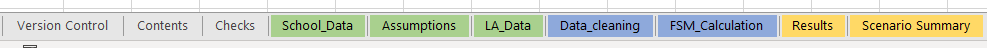
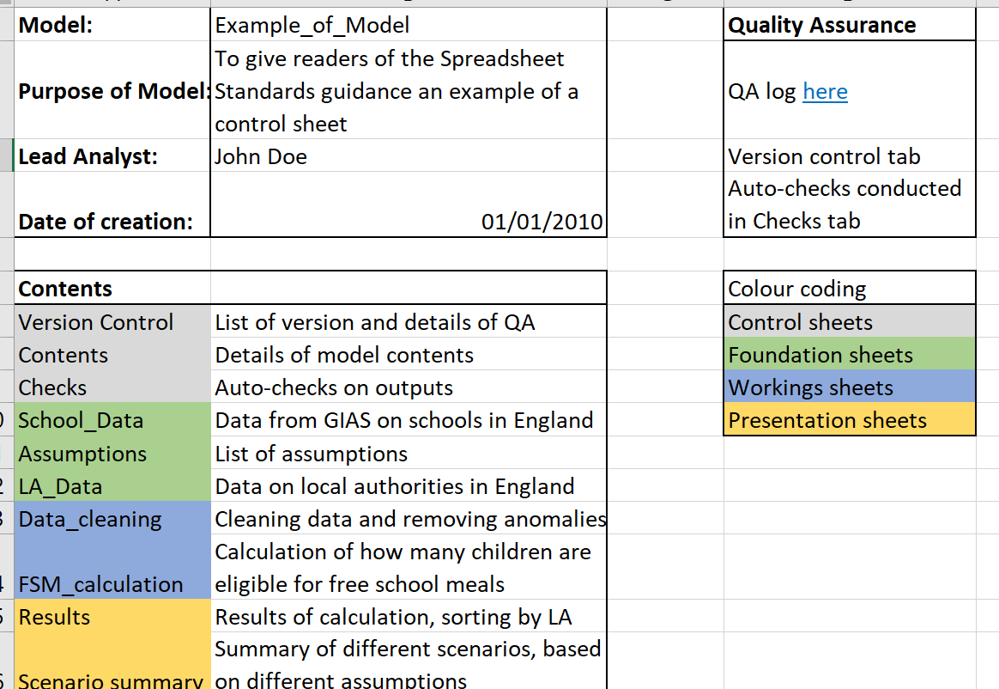
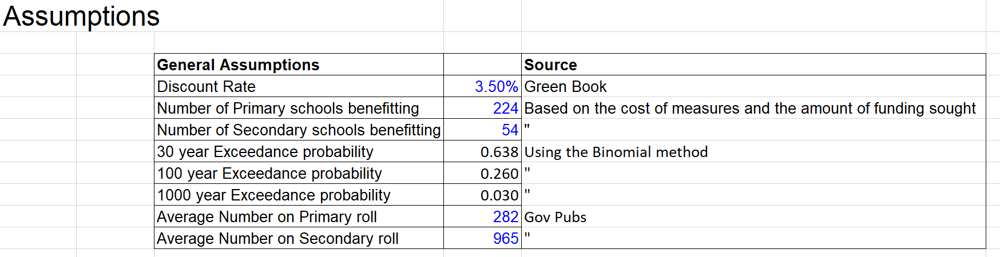
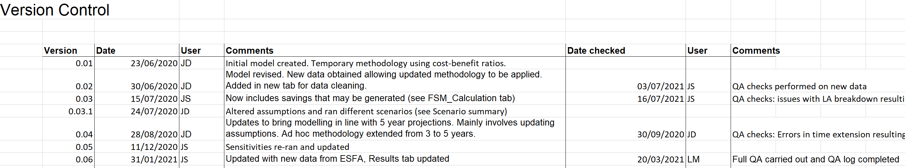

# Workbook, worksheets and formula design

## Introduction

Chapter 2 sets out the rules for spreadsheet modelling, organised into three main categories: 

* workbook design: rules relating to the high-level layout of your model; 

* worksheet design: rules relating to the layout of worksheets within your model; and 

* formula design: principles to ensure formula simplicity and formula clarity.

## Workbook design

**Group and separate worksheets by type**: You should have four groups/types of worksheets:

* control (e.g. containing check sheets, version control, table of contents, date created);  

* foundation (e.g. containing the model’s inputs);  

* workings (e.g. containing the model’s calculations); and 

* presentation (containing the outputs of the model). 

This separation offers numerous advantages; for example, ‘workings’ sheets should not be made ‘pretty’ at the expense of calculation clarity – this can be achieved on ‘presentation’ sheets which are designed to be seen by the commissioning policy customer.  

For smaller spreadsheet models, fewer worksheets can be used (e.g. merge the ‘control’ and ‘foundation’ sheets), as long as the layout is the same as a large spreadsheet model with multiple tabs. 

**All models must have a control sheet (or sheets)**: as a minimum, these should describe the purpose of the model, give the name of the analyst and date of creation, include a table of contents (with description of each sheet), provide details of the quality assurance undertaken, provide a key for any colour coding used, and list model assumptions and caveats. 

{width=50%}

**All input assumptions must have a recorded basis**: as a minimum, a full list of assumptions used through the model should be created. For models with a large number of assumptions, consider recording these on a separate control sheet. For the highest risk assumptions, a record of authorisation/sign-off must also be kept.  

{width=75%}

**All models must include a version control sheet**: this holds information on the file name, date, name of analyst making the change, sheet on which change is made, details of the change and record of subsequent QA. If a version of the model reflects a particular scenario, include a short description of this scenario in the file name or as a tag to the file. The model should be backed up to Azure DevOps, or saved in Sharepoint. This will allow you to revert to old versions, without needing to have multiple versions of the same document saved.

**Input data to the model**: liaise carefully with those supplying inputs to ensure a full appreciation of scope, definitions, etc. As a minimum, record the following information for input data: who supplied it and when, a link (if available, e.g. if it is published data), its level of quality assurance and if/when it requires updating.  

Input data in the spreadsheet should be exactly as supplied by the supplier; modellers should not be making manual adjustments to supplied data and any amendments should be done by auditable formulae within the model, not prior to the data going into the spreadsheet. 

**Distinguish model imports from model exports**: the approach here will be different depending on the size of your model (e.g. colour coding of cells within sheet versus separate tabs). Colour coding of cells/tabs can either be agreed within teams/units/divisions, or simply described on an information sheet so that it can be understood. Do be mindful of colleagues with visual impairments. 

**Where possible, use a consistent time ruler (e.g. monthly, quarterly) across or down all sheets**: adherence to this rule will do nothing for calculation speed, but will significantly improve the readability of the model and the likelihood of detecting logical errors. 

**Presentation Sheets**: must clearly and effectively present the results of the analysis. Ensure that final outputs and the input data/assumptions behind them do not become decoupled. Consider the audience for these sheets.  

If the model or presentational sheets are to be published, then the output must comply with Departmental accessibility standards. 

**Avoid splitting a model across multiple workbooks**: under certain circumstances, this will be unavoidable; for example, short lead times can necessitate individual modellers working in parallel on separate elements of the model. If data is passed between workbooks, clearly identify imports and exports. Naming links to external files will ensure your model tracks any changes to the location of data in the external file.

## Worksheet design

**Each column should have a single purpose**: particularly in models containing a large number of rows, a reviewer should be able to read the formula in the top cell and assume this is consistent all the way to the bottom (i.e. avoid a mix of different formulas and hardcoded values). Any exceptions to this must be clearly marked. And this does not over-ride the need for quality assurers to check sums at the bottom of columns or end of rows to ensure formulas are working. 

**Provide a clear and unique label for every column which is intuitive for a new user and includes the unit**: some calculation steps can be difficult to describe, but investing the time will reduce the risk of making faulty assumptions and assist the reviewer at a later stage. In addition, being consistent in labelling conventions will assist in using global find and replace if column labels require updating. 

**Avoid unnecessary columns of data**: if a column of data does not impact on calculations/aid the building of the model, review its inclusion. 

**Avoid hiding rows, columns and worksheets**: generally, any data used in calculations should not be hidden. This is permissible during the model development stage, but not if a model is going to be shared with others. 

**Calculation order on ‘workings’ sheets should flow left to right and top to bottom**: it is extremely helpful for a model reviewer to be able to assume that ‘reading order equals calculation order’. Any exceptions to this should be minimised and clearly marked. 

**Use auto-checks wherever possible**: for example, check that row and column totals are consistent across worksheets. Consider use of a single check sheet which holds all checks of internal consistency and uses conditional formatting to identify errors.

## Formula design

**Keep formulas as simple and efficient as possible**: if possible, break down very complex, multi-line formulas into smaller parts to aid the reviewer (smaller calculation steps may be required if you cannot explain a formula in a short amount of time). However, complex design is sometimes necessary, particularly when increasing model automation, in such cases, also add comments to help somebody else picking up the model. 

**If possible, use a limited set of Excel functions in the model**: avoid functions where the logic is difficult to follow. 

**If possible, avoid Excel functions that are sensitive to structural changes in the model**: some functions (e.g. VLOOKUP and HLOOKUP) can stop functioning as desired because of the insertion or deletion of a row or column and alternative functions (e.g. INDEX-MATCH) should be considered if the spreadsheet is likely to experience structural changes. 

**Minimise use of nested IF statements and array/CSE (CTRL+SHIFT+ENTER) formulas**: nested IF statements are difficult to de-code, reduce a model’s transparency and multiple combinations are often not properly tested. Large array/CSE formulas can slow down calculations and can be difficult to understand – use if the steps required to avoid using an array add unnecessary complexity. Single-cell array formulas are less error prone than multi-cell array formulas. 

**Avoid embedding constants in formulas**: this can conceal a model assumption and reduce a model’s flexibility. Instead, enter the constant in a clearly labelled cell, and link formulas to this cell.  Then, if you need to, by changing one cell, the constant is changed across all linked cells. In certain cases, however, embedding constants is permissible where they cannot be changed (e.g. 12 for months in a year). 

**Reserve use of the ROUND function for the ‘Presentation’ sheets**: perform all calculations on unrounded values. 

**Avoid using unnecessary parentheses in formulas**: unless they improve formula clarity or are mathematically necessary. 

**Do not use current sheet references in formulas**: these lead to cumbersome formulas which are harder to review. 

**When switching signs, use ‘-1 * a’ rather than ‘-a’**: this makes the sign switch as obvious as possible to the model reviewer. 

**VBA/Excel macros**: only use if they add significant value to the model or are necessary (e.g. iterative calculations). Any code must be clearly commented and there must be sufficient capability within the team/unit/division for quality assurance. 

Annex A contains a spreadsheet standards checklist for modellers to use when designing models. 
