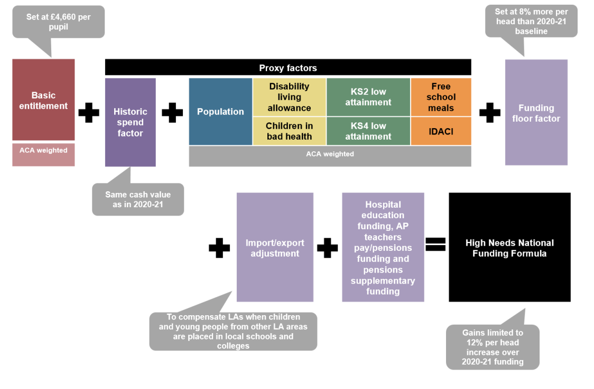
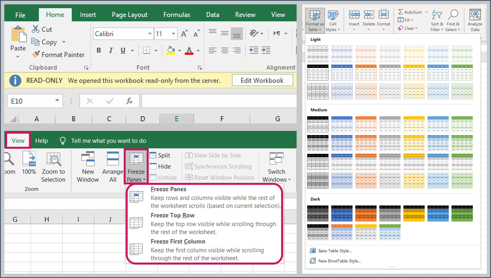
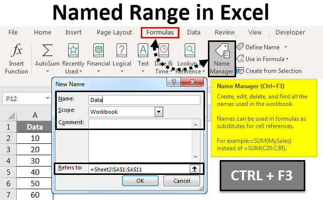

# Good practice for Excel-based modelling

## Introduction

This Chapter contains *suggestions* for taking advantage of Excel’s strengths in a modelling context. These are separate from the rules set out in Chapter 2 in acknowledgement of the unique preferences of individual modellers for building models in Excel.  

We also provide links to good practice spreadsheets within the Department, and links to external guidance on spreadsheet modelling for reference.

## Good practice in Excel

**Control sheets**: if sharing a large, complex model, consider including a flow diagram, for example using Excel ‘SmartArt’, to graphically illustrate the model’s structure. 

**Do not repeat calculations unnecessarily**: even if it is simple to replicate the calculation, it is generally best practice to link back to the source calculation.  During model development, there may be need to do repeat calculations, but this does introduce a verification risk, so care should be taken. 

**Minimise inter-linking between sheets**: in particular linking should only be in one direction and not back and forth across worksheets. Excessive inter-linking can be an indication of poor logic in the design of the model and can complicate the review process. 

**Presentation sheets**: adding a ‘control’ element to a presentation sheet can enable users to manipulate the dynamic aspects of a model and see the results without having to shuffle sheets. This also serves as a high-level QA check of the model’s functionality (i.e. do outputs change as expected). 

**Save files as ‘read-only’**: ensuring Excel files open as read-only enforces version control as a new version must be saved if changes are made. 

**Use hyperlinks to share models rather than sending by email**: this prevents there being multiple versions of the same model in existence. 

**Display column headers and row labels only once in a freeze pane**: include any internal consistency checks (e.g. TRUE/FALSE) in this freeze pane so they are clearly visible. 

**Do not merge cells**: merged cells can affect the selection of columns and/or rows, are problematic for macros and unmerging cells is time-consuming. As an alternative, use the ‘Center Across Selection’ option from the ‘Format Cells’ dialogue box to achieve the same presentation. 

**Use Named Ranges**: naming individual cells or ranges makes formulas easier to read and understand (e.g. =PRICE\*VAT is easier to understand than =A1\*B1). Carefully manage named ranges using the Excel Name Manager and ensure they are global (rather than local) and well-documented on information sheets.

**In Excel 2010, use the ‘Format as Table’ option for your data**: in this format, formulas entered in the top cell are automatically copied to the bottom of the column. In addition, any formulas that refer to cells in the table will show the column heading in the formula, which improves formula comprehension/clarity. 

**Excel formulas can contain spaces**: these can be used to separate arguments in complex formulas to improve readability. Also the ALT-RETURN combination can be used to start a new line in the formula bar. 

**Make use of Excel’s Formula Auditing tool on the ‘Formulas’ tab**: use the Trace Precedents and Trace Dependents commands to graphically display the relationships between cells and formulas with tracer arrows. The Evaluate Formula tool can also be used to debug a formula by evaluating each part of the formula separately. 

**Where possible, make use of Excel keyboard shortcuts**: as well as improving the speed at which you can work in Excel, keyboard shortcuts can reduce the risk of making errors (e.g. CTRL+SHIFT+UP/DOWN/LEFT/RIGHT is a reliable way of selecting data ranges).

## Good practice spreadsheets

The DfE's Quality Assurance pages are [here](https://educationgovuk.sharepoint.com/sites/sarpi/g/SitePages/Quality-Assurance.aspx). As modellers find examples of best practice, or indeed consider their own models exemplars, these should be shared with the QA team via education.QATEAM@education.gov.uk. The intranet pages will be updated with these examples in due course.  There is a strong need for modellers to share and learn from best practice, and senior analysts should encourage the use of this area.

## Useful links

* [The FAST Standard organisation](http://www.fast-standard.org/)

* [The Spreadsheet Standards Review Board](http://www.ssrb.org/)

* [List of Excel keyboard shortcuts](https://support.microsoft.com/en-us/office/keyboard-shortcuts-in-excel-1798d9d5-842a-42b8-9c99-9b7213f0040fq)

